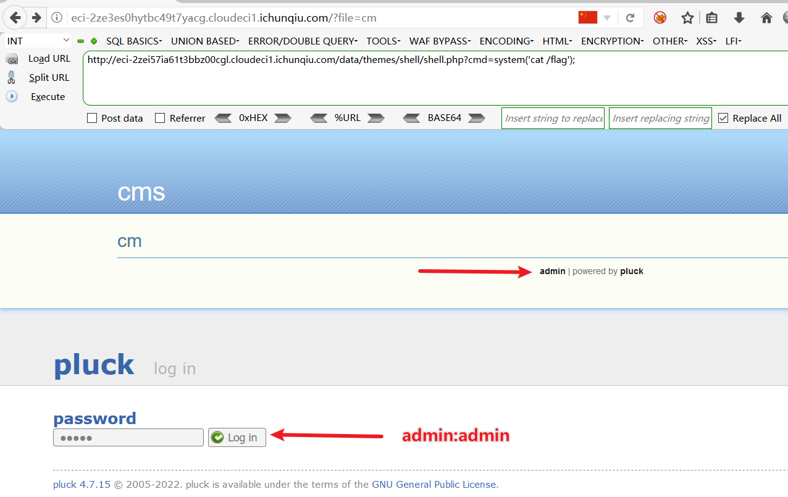
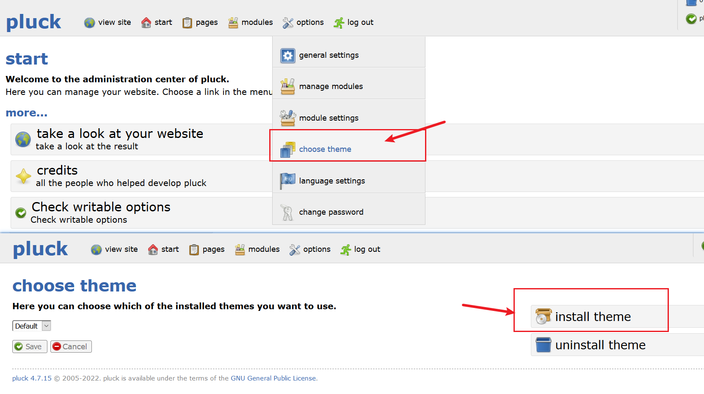
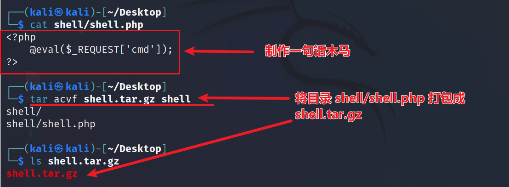
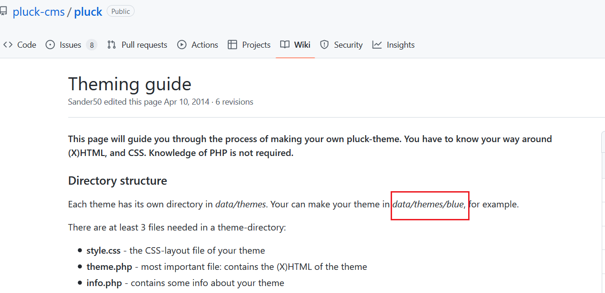
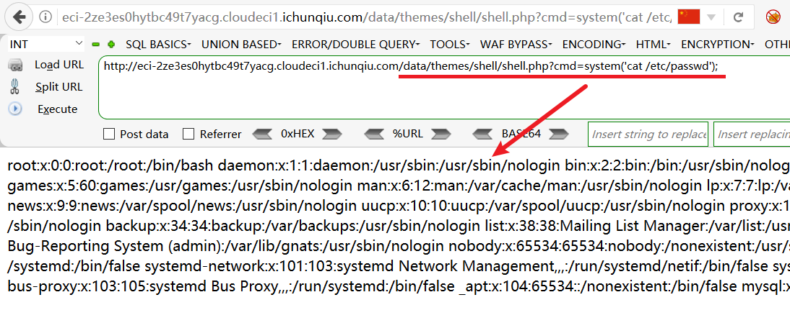

# CVE-2022-26965

## Description

在 Pluck 4.7.16 中，管理员用户可以使用 /admin.php?action=themeinstall 中的主题上传功能来执行远程代码执行。

## Explanation of exploit; PoC

1. 首先使用 admin:admin 登录后台，如下图：

    

2. 点击主题管理，点击上传主题，如下图：

    
3. 制作一句话木马 shell.php, 并将目录压缩为 shell.tar.gz 格式，如下图：

    
4. 上传 shell.tar.gz 文件，如下图：

    
5. 上传成功后，主题文件存放在 `/data/themes/` 目录下，如下图：

    
6. 访问 shell.php，执行命令获取flag，如下图：

    
7. 访问 shell.php，执行命令查看 /etc/passwd 文件，如下图：

    

## Mitigation

该漏洞是通过上传主题文件来执行远程代码执行，因此可以通过限制上传文件的后缀名来进行防御。

## Refer
- https://nvd.nist.gov/vuln/detail/CVE-2022-26965
- https://packetstormsecurity.com/files/166336/Pluck-CMS-4.7.16-Shell-Upload.html
- https://github.com/pluck-cms/themes